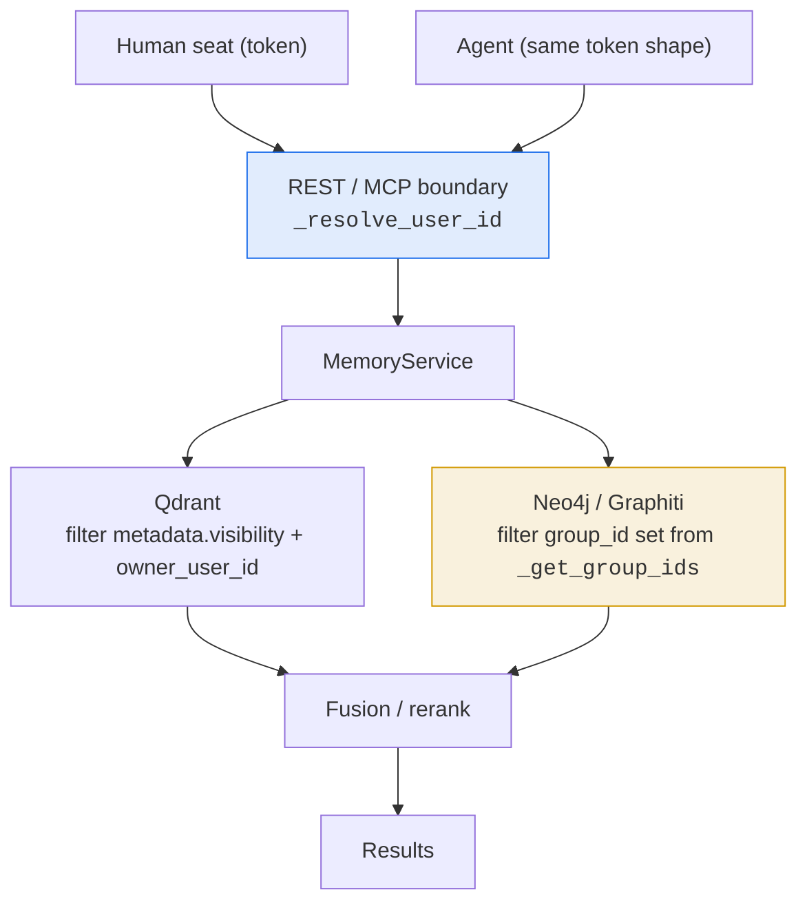
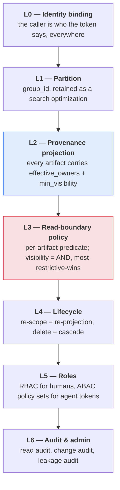
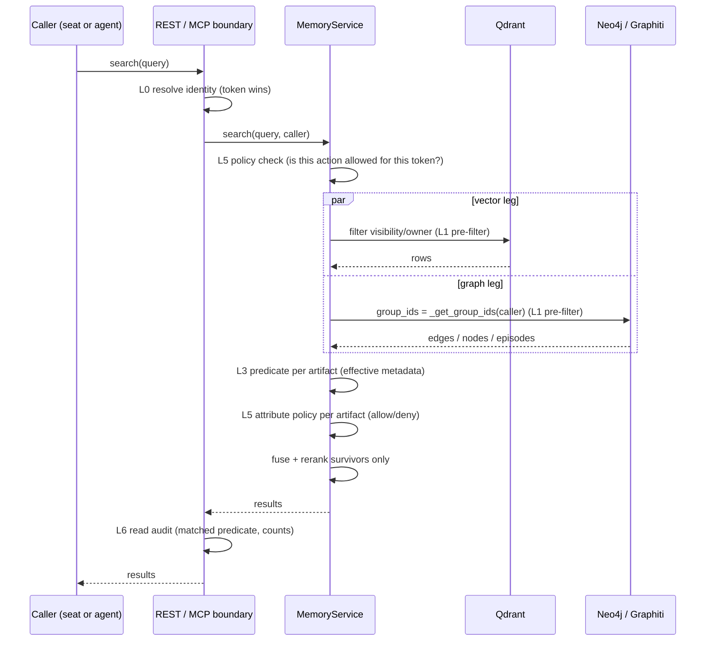
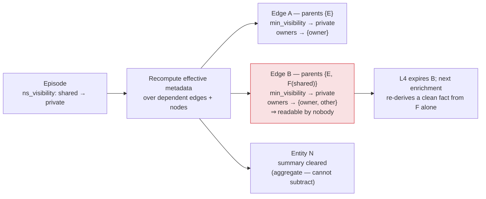
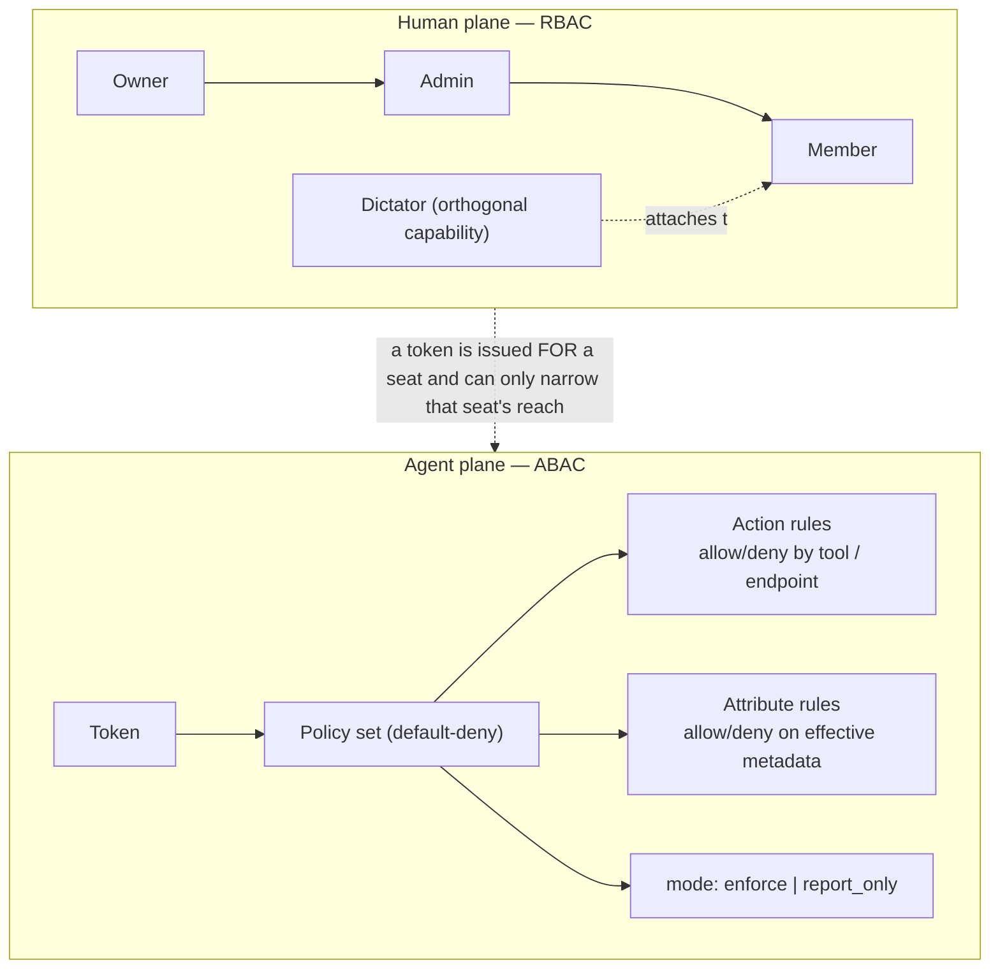
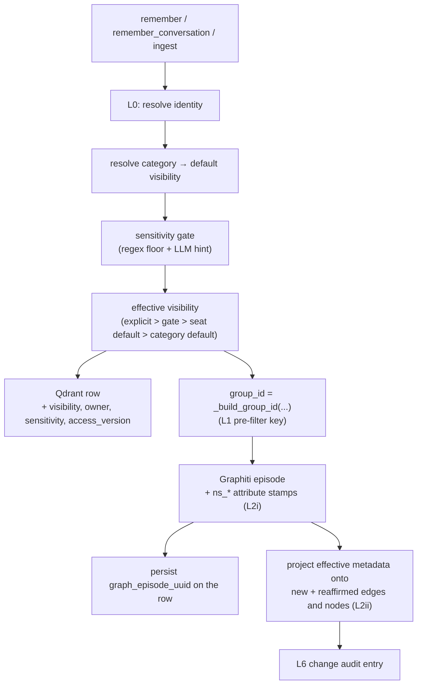
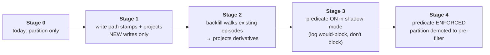
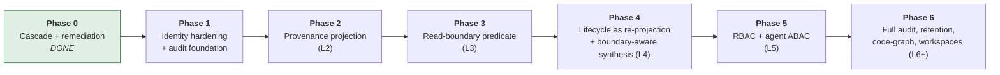

# Neuralscape Access Model v2

**Provenance-based access control for a multi-seat agentic memory layer.**

Status: design document (W6 of the access-control workstream). Phase 0 of the roadmap has landed on `hotfix/private-graph-cascade`; Phases 1–6 are proposed, not implemented.
Audience: Neuralscape maintainers and deployment operators.

## Contents

1. [Purpose & scope](#1-purpose--scope) · 2. [Threat model](#2-threat-model) · 3. [Current model (v1)](#3-current-model-v1) · 4. [Target model (v2)](#4-target-model-v2) · 5. [Data model diffs](#5-data-model-diffs) · 6. [Write/read path changes](#6-writeread-path-changes) · 7. [Migration & backfill](#7-migration--backfill) · 8. [Performance](#8-performance-why-materialize) · 9. [Dreaming, dedup, communities](#9-dreaming-dedup-communities) · 10. [Defaults & product decisions](#10-defaults--product-decisions) · 11. [Test matrix & benchmark gates](#11-test-matrix--benchmark-gates) · 12. [Sequential roadmap](#12-sequential-roadmap) · 13. [Deliberate divergences](#13-deliberate-divergences) · 14. [Open questions](#14-open-questions)

---

## 1. Purpose & scope

Neuralscape stores memories in two coupled substrates: a vector store (Qdrant) holding one row per memory, and a temporal knowledge graph (Neo4j via Graphiti) holding *derived* artifacts — episodes, entity nodes, fact edges — extracted from those memories by an LLM.

The row and its derivatives are not the same object. The row is what the user wrote; the derivatives are what the system inferred. v1's access control was designed around the row and extended to the graph by assigning each write to a graph partition (`group_id`) computed from the row's visibility. That holds while a memory never changes tier. It fails the moment a memory's access attributes change *after* derivation, because a derived artifact has no independent record of where it came from — only which partition it happens to sit in.

This document specifies **v2**: every derived artifact carries materialized, provenance-derived access metadata, and every read is a predicate over that metadata rather than a partition lookup. It covers the threat model, what v1 guarantees and where it stops, the six v2 layers, the data-model/write-path/read-path changes, migration, and a dependency-ordered roadmap.

**Out of scope:** encryption at rest, transport security, secret management, tenant billing isolation, and the OAuth/OIDC login flows (v2 consumes an authenticated identity; it does not define how one is established). Code-graph artifacts are deferred to Phase 6.

---

## 2. Threat model

### 2.1 Deployment shape

The target is a **single service instance serving a small multi-seat team** — roughly 2–50 human seats, self-hosted, one Neo4j / Qdrant / Redis behind it. Seats are colleagues, not mutually hostile tenants — but "colleagues" is not "everyone may read everything", and the private tier exists precisely because some of what a seat writes is theirs alone. There is no hardware-level tenant isolation: one process, one database, many identities.

| Tier | Readable by | Writable by | Purpose |
|---|---|---|---|
| `private` | owner only | owner | personal facts, WIP, anything sensitive |
| `shared` | any authenticated seat | owner (content/tier), team (metadata) | team knowledge pool |
| `standard` | every caller; injected at session start | dictators only | authoritative org rules |

### 2.2 Principals

- **Human seats** — authenticated by a signed token (or a federated login that mints one).
- **Agents** — LLM-driven callers holding a token. An agent is *not* a trusted principal: it is a program whose control flow is partly determined by text it reads, and some of that text comes out of the memory layer itself.
- **Dictators** — a configured allowlist of user_ids permitted to write the `standard` tier and run admin operations.
- **Operators** — hold the deployment's credentials. Out of scope as adversaries; they can read the raw stores.

### 2.3 Adversaries

**A1 — Curious or careless seat.** A legitimate colleague queries broadly and gets back something they shouldn't. The dominant real-world risk in a small team, and it requires no malice — only a read path that returns an artifact whose access attributes were never checked.

**A2 — Identity-confusion caller.** Supplies a `user_id` in a body or query string that isn't theirs. Any endpoint that accepts a caller-supplied identity alongside a verified token is an impersonation primitive.

**A3 — Prompt-injected agent.** An agent reads attacker-controlled text — a web page, a repo file, an ingested document, or *a memory written by someone else* — and is steered into exfiltrating whatever its token can reach. The defense is not a smarter agent; it is a smaller token reach. This is the strongest argument for attribute-scoped agent credentials (L5).

**A4 — Derivation leakage.** The class the Phase 0 hotfix closed. A memory is written at one tier, the graph derives facts/entities/summaries from it, then the memory's tier changes or the memory is deleted. If the derivatives don't follow, the content stays readable at the old tier indefinitely — via graph search, the graph leg of hybrid search, node summaries, and raw episode listing. The user believes they made something private; the system still serves it. **v2 exists to make this class structurally impossible.**

**A5 — Aggregation leakage.** A derived artifact that is not a copy of any single memory but a synthesis over several: an entity summary, a community summary, a dreaming consolidation, a wiki card. A correct per-artifact predicate still leaks if the artifact was synthesized across a boundary before the predicate ran. Partially addressed in Phase 0 (summaries cleared on cascade); fully addressed only when synthesis becomes boundary-aware (Phase 4, and Q1).

**A6 — Oracle probing.** Distinguishing "no such id" from "exists but not yours". A 403 on a specific memory id confirms the id exists and belongs to someone. The hotfix maps unreadable to 404 on `get_memory` and folds an unreadable reasoning-chain premise into the existing `missing` marker.

### 2.4 Non-goals

Defending against the operator or direct DB access; cryptographic enforcement (per-user content encryption); preventing a seat from re-publishing what they legitimately read; covert-channel resistance (a filtering predicate changes result counts, and we accept that).

---

## 3. Current model (v1)

### 3.1 As shipped



**Identity binding.** `main.py::_resolve_user_id(request, body_user_id)` is the single resolution point. With a verified per-user HMAC token, `request.state.user_id` wins and a disagreeing body/query id is a 400. Without `neuralscape_user_token_secret`, the deployment is in legacy single-key mode and the body's `user_id` is trusted.

**Partition.** `memory/groups.py::_build_group_id(visibility, user_id, project_id, workspace)` maps a write's access attributes to exactly one `group_id`:

| visibility | project | workspace | group_id |
|---|---|---|---|
| private | — / set | default | `user--{uid}` / `user--{uid}--project--{pid}` |
| shared | — / set | default | `shared` / `shared--project--{pid}` |
| standard | — / set | default | `standard` / `standard--project--{pid}` |
| any | any | `<ref>` | `<above>--ws--{workspace}` |

**Read scoping.** `_get_group_ids(caller, project_id)` returns the readable set: the caller's `user--{id}` namespace, `shared`, the project-scoped equivalents, plus `standard` when enabled. Graph searches pass it as `group_ids`; the vector side filters on `metadata.visibility` / `metadata.owner_user_id`.

**Edit/delete gates.** `_check_edit_permission(...)` implements the locked split: dictators may edit anything; `standard` is dictator-only; for `shared`, organizational metadata (tags/category/project) is team-editable housekeeping while content and visibility changes are owner-only; `private` and legacy null-visibility are owner-only.

**Dictator role.** `settings.is_dictator(user_id)` against the `dictator_user_ids` CSV allowlist.

**Category defaults.** `schemas.DEFAULT_VISIBILITY_FOR_CATEGORY` maps each core category to a default tier — personal/working categories to `private`; `tech_stack`, `convention`, `architecture`, `dependency`, `decision`, `interaction`, `workflow`, `procedure` to `shared`. Unknown categories fall back to `private`.

### 3.2 What v1 guarantees

1. On `/v1/*`, a caller's identity cannot be spoofed when per-user tokens are configured.
2. A memory written `private` lands in a `group_id` no other caller's `_get_group_ids` returns, and a Qdrant row no other caller's filter matches. **At write time**, private stays private.
3. Content and tier changes to someone else's memory are refused.
4. The `standard` tier is write-gated to dictators.

### 3.3 Where v1 stops — precisely

**(a) Enforcement lives at the partition boundary, not on the artifact.** The only thing making a graph artifact private is which `group_id` it was written into. Nothing on the edge, node, or episode says "the owner considers this private". A read is authorized by asking *where the artifact is stored*, never *what it derives from*. Partition membership is therefore security-critical state that must stay perfectly in sync with the attributes it was derived from — and nothing keeps it in sync after the fact.

**(b) Derived artifacts carry no provenance-derived access attributes.** One partial exception, whose limits are instructive: `write.py::_attach_memory_id_to_graph_nodes` → `extensions/dreaming/graph_patcher.py::attach_memory_id` stamps `memory_id`, `ns_visibility`, `ns_owner` onto nodes after a write. But it matches by a **time window** (`created_at >= write_started_at − window`) intersected with the group, not by provenance; it uses `coalesce(...)` so the **first** writer wins and reaffirmations never update it; it is single-valued so it cannot represent mixed parentage; it stamps nodes, not edges; and it exists for the wiki synthesizer's community → source walk. **No read path consults it.** It is metadata, not policy.

**(c) A visibility change was string-matched, not projected.** Pre-hotfix, a tier migration called an edge-expiry routine that expired an edge only when the raw memory text was a literal lowercase substring of the edge's `fact`. Graphiti facts are LLM paraphrases, so the match rate was effectively zero: a silent no-op, and the derived facts stayed live at the old tier permanently.

**(d) Aggregate artifacts were never regenerated.** Entity `summary` fields are LLM syntheses over every mentioning episode; nothing cleared or regenerated them when a contributing episode's attributes changed.

**(e) Episode content is itself an artifact.** On the single-fact write path the episode body is byte-identical to the memory text, so anything that lists or full-text-searches episodes is a read path over raw memory content.

**(f) Legacy root endpoints trusted caller-supplied identity** — `/memories`, `/search`, `/graph/*` took `user_id` from the body/query even with a verified token present.

**(g) Read-by-id had no gate.** `GET /v1/memories/{id}` and the reasoning-chain walk never passed caller identity into the service, so the owner-only rule for private memories was defined but never applied there.

### 3.4 What the Phase 0 hotfix added

Seven fix commits (plus a measurement chore) close (c), (d), (f), (g) and harden (e). They do **not** change (a) or (b): partition is still the security boundary, and artifacts still carry no enforceable provenance-derived attributes.

| Fix | Module | What it establishes |
|---|---|---|
| Exact-provenance cascade | `memory/provenance.py` *(new)* | Resolve a memory's Graphiti **episode** by persisted uuid → verbatim content → deterministic name (all exact equality, never fuzzy), then expire everything it contributed: soft-expire every edge it created *or reaffirmed*, clear the `summary` of every entity it mentions, remove solely-mentioned entities, hard-delete the episode node. Idempotent, never raises, WARNING on failure. |
| Durable memory→episode link | `provenance.py::_persist_graph_episode_ref` | Stamps `graph_episode_uuid` / `graph_episode_name` on the Qdrant row at enrich time via an additive nested-key merge, so lifecycle operations resolve the exact episode instead of guessing. |
| Cascade wired into lifecycle | `memory/edit.py`, `memory/delete.py` | Tier migration and every delete path call `_cascade_or_fallback_expire`; the substring routine survives only as a loudly-logged last resort, and unresolved rows surface in the task result instead of being silently absorbed. |
| Backward remediation + audit | `memory/remediation.py` *(new)* | `rescope_private_derivatives(user_id, dry_run=True)` derives candidate shared-side groups from `_build_group_id`, resolves each private memory's episode there, and cascades. `audit_private_leakage(user_id)` is a read-only proof across three surfaces (live edges, non-empty entity summaries, raw episode content) plus a clearly-separated heuristic backstop. Dictator-gated, REST + MCP, `dry_run` defaults true. |
| Write-time sensitivity gate | `memory/sensitivity.py` *(new)*, `config.py`, `prompts.py` | A deterministic, zero-LLM-cost regex floor classifies content into `credentials_pii` / `equity_compensation` / `client_commercial` / `financial`, combined with an optional LLM hint parsed from the existing extraction prompt. A match in the configured class set forces `visibility=private` unless the caller both set `visibility` explicitly *and* passed `sensitivity_override=True`. Feature-flagged and per-class — never blanket privacy. |
| Expired artifacts excluded from listings | `memory/graph_admin.py` | `get_graph_nodes` / `get_graph_edges` default-exclude expired/invalidated artifacts using the search path's liveness definition, with an `include_expired=True` operator hatch. |
| Identity fixes | `main.py`, `memory/reads.py` | Legacy root endpoints resolve identity through `_resolve_user_id` (token wins, mismatch → 400). `get_memory` / `get_reasoning_chain` take a caller id; unreadable maps to 404 and an unreadable premise folds into `missing`, so a chain leaks neither content nor existence. |

Two Phase 0 decisions carry forward as v2 invariants:

- **Most-restrictive-wins on cascade.** An edge is expired even when another live episode also asserts it. Mixed parentage does not protect an artifact. Transient recall loss is accepted over a wrongly-live sensitive fact; a colleague's own episode re-derives a clean fact on the next enrichment pass.
- **Summaries are cleared unconditionally**, not only when the episode was the node's sole mention — a summary is an LLM aggregate and one contributor cannot be safely subtracted from it.

---

## 4. Target model (v2)

v2 replaces *authorize by partition* with *authorize by predicate over materialized, provenance-derived metadata*. Six layers, each with one job and one invariant.



### L0 — Identity binding

**Invariant: no read or write path anywhere accepts a caller-supplied `user_id` when a verified token identity is available.**

1. With `neuralscape_user_token_secret` configured, `request.state.user_id` is authoritative on **every** route — v1, legacy root, MCP, admin. A disagreeing body/query id is a 400, never a silent override.
2. MCP tools operating on the caller's own memory take **no** user/graph/project argument; the target is fixed by the authenticated identity. (A commercial Graphiti-based platform scopes its MCP surface the same way, precisely so one person's token cannot select another person's memory.)
3. Legacy single-shared-key mode stays supported but is documented as **single-tenant only**, with a startup warning: a deployment with more than one seat and no token secret has no meaningful access control.
4. An operation on another principal's data (admin remediation, cross-seat audit) is never "pass a different user_id". It is a distinct, role-gated endpoint with an explicit, audited subject.

### L1 — Partition (an optimization, not the boundary)

**Invariant: correctness never depends on partition membership.**

`group_id` stays. It is a good index — it keeps a search over one seat's private namespace from scanning the whole graph and maps cleanly onto Graphiti's native `group_ids` filter. What changes is its *status*: in v2 it is a **pre-filter for performance**, and the L3 predicate is applied to every artifact that survives it. If a bug ever files an artifact into the wrong partition, L3 still refuses to return it, because L3 asks the artifact what it derives from, not where it lives.

### L2 — Provenance projection

**Invariant: every derived artifact carries materialized effective access metadata, maintained on creation, reaffirmation, and merge.**

**(i) Stamp the source.** Every episode carries the write's access attributes as first-class properties — `ns_owner_user_id`, `ns_visibility`, `ns_project_id`, `ns_sensitivity`, `ns_memory_id`. These are exactly the values `memory/write.py` already resolves (`effective_visibility`, owner, project, plus the Phase 0 sensitivity class), so stamping costs nothing and makes the episode self-describing rather than describable only by its partition.

**(ii) Project onto derivatives.** Every entity node and `RELATES_TO` edge carries *materialized effective metadata* aggregated over all episodes behind it: `ns_effective_owners` (set union), `ns_min_visibility` (most restrictive parent), `ns_effective_projects` (union), `ns_max_sensitivity` (most restrictive class present), alongside the parent-episode list edges already carry.

Projecting ingestion-time metadata onto every derived artifact, and evaluating policy against the *combined, deduplicated* set, is the mechanism a commercial Graphiti-based platform describes as a natural consequence of the architecture rather than a bolted-on feature. NS adopts the mechanism; it does **not** adopt the accompanying framing that the combination predicate is entirely the application's business (see L3).

**Maintenance points.** Projection is not write-once. It is recomputed wherever an artifact's parent set changes:

| Event | Recompute |
|---|---|
| edge created by a new episode | initialize from that episode |
| edge **reaffirmed** by a later episode | union owners/projects; re-min visibility; re-max sensitivity |
| edge invalidated | no access-metadata change (still admin-queryable) |
| entity merged (entity resolution) | union both sides' parent sets, then recompute |
| entity mentioned by a new episode | union |
| parent episode's attributes change (L4 re-scope) | recompute over the surviving parent set |
| parent episode deleted (L4 cascade) | recompute over the surviving parent set |

Union-on-merge matches how Graphiti already keeps episode associations from both sides when entities merge; v2 makes the access consequence explicit.

### L3 — Read-boundary policy

**Invariant: a read returns an artifact only if the caller satisfies a predicate over that artifact's effective metadata — and for visibility the predicate is AND / most-restrictive-wins, always, not configurable.**

```
readable(C, A)  ⇔
      A.ns_min_visibility == "standard"
   OR A.ns_min_visibility == "shared"
   OR (A.ns_min_visibility == "private" AND C ∈ A.ns_effective_owners
                                        AND |A.ns_effective_owners| == 1)
```

Read the last clause carefully. An artifact whose parent set contains *any* private episode has `ns_min_visibility == "private"`. If a fact was co-derived from one seat's private episode and another seat's shared episode, **nobody** reads it — not even the private owner, because the effective owner set has more than one member and the artifact is a synthesis across a boundary. L4 expires it on the next lifecycle event, and it is re-derived cleanly from whichever parents remain.

**Why AND is a hard invariant.** The competitor study is explicit that mixed parentage is ambiguous — a fact with three parents, two marked verified and one not, has effective `verified = [true, false]`, and the same graph shape supports opposite policies depending on use case, so the predicate is exposed as configurable AND/OR groups and the application chooses. That reasoning is right **for trust and quality attributes** and wrong **for confidentiality**. Choosing OR on `verified` means "I'll accept a less-vetted source" — a recall/precision trade the application legitimately owns. Choosing OR on `visibility` means "one shared parent is enough to publish a fact a private parent also supports" — exactly the leak this workstream exists to eliminate, and not a trade an application should be able to make with a flag.

| Attribute class | Combination rule | Configurable? |
|---|---|---|
| `visibility` | AND / most-restrictive-wins | **No — hard invariant** |
| `owner` | intersection semantics as above | **No** |
| `sensitivity` | most-restrictive class wins | No (the class *set* is configurable; the rule is not) |
| `project` | union; membership checked separately | Partly (scope selection) |
| trust/verification tags (future) | AND **or** OR, caller's choice | Yes (Phase 5) |

A configurable AND/OR predicate over *trust* tags is genuinely useful and is planned. It never applies to visibility.

**Where the predicate runs** — three enforcement points, all in the service layer, none optional:



1. **Graph leg of hybrid search** (`memory/search.py`) — after Graphiti returns artifacts, before fusion.
2. **Direct graph endpoints** — `/v1/graph/search`, `/graph/*`, node/edge/episode listing, episode full-text search: same predicate, same function.
3. **Vector leg and read-by-id** — a non-derived artifact's own `visibility`/`owner_user_id` *are* its L2 attributes, so the predicate degenerates to today's check, expressed through the same function so there is one definition of "readable".

**Episode content is an artifact.** `Episodic.content` is memory text; every listing and full-text path over episodes evaluates the same predicate. Phase 0 removed the "expired but still listed" gap for nodes and edges; L3 closes the episode equivalent structurally, by making the check about attributes rather than liveness.

**Fail-closed.** Missing or unparseable effective metadata → predicate false, artifact dropped, WARNING logged. A backfill gap must degrade to reduced recall, never to exposure.

### L4 — Lifecycle

**Invariant: an access-attribute change is a metadata re-projection, and a delete is a provenance cascade. Neither is ever a text match.**

**Visibility change = re-projection.** Today a tier change means "move the row, destroy the old derivation, re-derive from scratch" (Phase 0's cascade + re-enrichment). In v2: update the episode's `ns_visibility` in place, then recompute effective metadata on every artifact whose parent set contains it. No re-extraction, no LLM call, no transient recall loss in the single-parent case.



Edge B is where the hard AND invariant does real work: the edge is neither silently downgraded nor left readable. It becomes readable by nobody, is expired, and the still-live shared parent re-derives an equivalent clean fact. Most-restrictive-wins with a re-derivation escape valve.

Entity summaries stay a special case — unconditionally cleared for every entity the re-projected episode mentions, with re-summarization scheduled on the enrichment queue.

**Delete = cascade with support counting.** A fact survives only while at least one *readable* episode still supports it. This is the same rule a commercial Graphiti-based platform describes for right-to-be-forgotten: remove a fact or node only when no remaining episode supports it, so deleting one of three conversations that independently established a relationship does not remove the fact. NS adds one twist — support is counted over episodes **still readable at the querying boundary**, not merely over episodes that still exist. An edge supported only by episodes nobody can read is not a surviving fact; it is a leak with extra steps.

Phase 0 implements the deletion half in its strictest form (expire even multi-parent edges). Phase 4 relaxes it to support-counted survival **only** once effective metadata is materialized and trustworthy — never before.

**The episode itself is an artifact.** Deleting a memory hard-deletes its episode node, as Phase 0 does. NS deliberately diverges from the "episodes are the raw, non-lossy record and are never discarded" stance: an episode body on the single-fact path *is* the user's text, and a self-hosted product that promises deletion must actually delete it.

### L5 — Roles: two planes

**Invariant: humans get roles; tokens get policies; agent tokens are default-deny.**



| Role | Can |
|---|---|
| **Member** | read/write own private; read shared + standard; write shared; edit own content/tier; edit shared metadata |
| **Dictator** | Member + write/delete `standard`-tier memories (existing capability, kept as an orthogonal flag rather than a rank) |
| **Admin** | Member + run remediation/audit for any seat, manage seats and token policy sets, read the change audit |
| **Owner** | Admin + deployment configuration, sensitivity class set, role assignment |

Today only Member and Dictator exist. Admin/Owner arrive in Phase 5 and must be backward compatible: a deployment with only `dictator_user_ids` set behaves as if dictators are Admins.

**Agent plane (ABAC).** A token carries zero or more **policy sets** — named, versioned documents with `mode` (`enforce` | `report_only`), `default` (`deny` for agent tokens, `allow` only for legacy compatibility), `actions` (allow/deny over MCP tool names and REST operation ids, plus a `readonly` macro), and `attributes` (allow/deny predicates over an artifact's effective metadata: visibility, sensitivity, project_id, category, tags, workspace). `report_only` evaluates every rule and logs what *would* have been blocked without blocking it — the dry-run discipline that makes a restrictive rollout survivable.

Two rules keep this from becoming a privilege-escalation surface:

1. **A policy set can only narrow.** Effective permission is `seat_permissions ∩ policy_set`. Attaching a policy is never a way to reach another seat's private memories.
2. **The L3 visibility invariant is not expressible in a policy.** No attribute rule turns the AND predicate into an OR. Policies subtract; they never relax confidentiality.

```yaml
policy_set:
  name: code_review_agent
  mode: report_only          # flip to `enforce` after a clean soak
  default: deny
  actions:
    allow: [recall_memories, search_knowledge_graph, get_project_context]
  attributes:
    allow:
      visibility: [shared, standard]
      project_id: ["<project>"]
    deny:
      sensitivity: [credentials_pii, financial, equity_compensation, client_commercial]
```

The motivation is A3: an agent that can browse the web can be prompt-injected, and a prompt-injected agent will try to exfiltrate whatever it can reach. A token scoped to only what that agent needs bounds the blast radius. This is the highest-leverage v2 capability for agentic deployments, and it is only meaningful once L2 metadata exists to evaluate attribute rules against — hence its position after projection.

### L6 — Audit and admin

**Invariant: every access decision and every access-attribute change is reconstructible after the fact.**

**Read audit** — *what did this principal see, and why was it allowed?* One record per read: timestamp, principal, token/policy-set identity, operation, query fingerprint (not raw text by default), the **matched predicate** (which L3 branch admitted each class of result), counts of returned vs. filtered artifacts, per-artifact ids at configurable verbosity. Filtered counts matter: a spike in "filtered" on one token is what a probing agent looks like.

**Change audit** — *who changed an access attribute, from what to what?* One record per visibility change, ownership change, role assignment, policy attach/detach, dictator-list change, and sensitivity-config change, each with a **before/after snapshot** and the acting principal. The competitor audits connection changes with the member who made them and a before-and-after snapshot; the pattern is right, extended here to visibility changes, which are the attribute NS actually cares about.

**Leakage audit** — *is the model holding?* `audit_private_leakage`, generalized. In v1 it is a forensic tool scanning three surfaces plus a heuristic backstop. In v2, with L2 materialized and L3 enforced, an owner-scoped leakage audit **must return zero by construction**, and any non-zero result is a projection-maintenance bug, not a missed cleanup. It runs as a graph-worker cron emitting a gauge, not a report.

**Admin surface.** All admin operations are Admin/Owner-gated, take an explicit subject, default to `dry_run=True` where they mutate, are idempotent, and write to the change audit. An account-level **kill switch** disables all agent tokens at once and overrides every policy set.

---

## 5. Data model diffs

### 5.1 Neo4j

**`Episodic`** — new properties, all stamped at `add_episode` from values the write path already holds:

| Property | Type | Notes |
|---|---|---|
| `ns_owner_user_id` | string | the writing seat |
| `ns_visibility` | string | `private` / `shared` / `standard` |
| `ns_project_id` | string? | |
| `ns_sensitivity` | string? | class from the write-time gate |
| `ns_memory_id` | string | durable reverse link to the Qdrant row |
| `ns_schema_version` | int | projection schema version, for staged backfill |

**`Entity`** and **`RELATES_TO`** — new materialized properties, recomputed at every parent-set change:

| Property | Type | Notes |
|---|---|---|
| `ns_effective_owners` | list\<string\> | set union over parent episodes |
| `ns_min_visibility` | string | most restrictive parent |
| `ns_effective_projects` | list\<string\> | set union |
| `ns_max_sensitivity` | string? | most restrictive class present |
| `ns_projection_at` | datetime | last recompute — staleness detection |
| `ns_workspace` | string? | reserved (see Q3) |

The heuristic `memory_id` / `ns_visibility` / `ns_owner` stamps from `attach_memory_id` are **superseded**. They stay readable during migration (the wiki synthesizer uses them) and retire at the end of Phase 2. Note the name collision: `Entity.ns_visibility` (single-valued, window-matched, first-writer-wins) is *not* `Entity.ns_min_visibility` (aggregate, provenance-derived, maintained). Phase 2 writes the new properties and leaves the old ones untouched.

Indexes:

```cypher
CREATE INDEX ns_edge_minvis    IF NOT EXISTS FOR ()-[r:RELATES_TO]-() ON (r.ns_min_visibility);
CREATE INDEX ns_entity_minvis  IF NOT EXISTS FOR (n:Entity)           ON (n.ns_min_visibility);
CREATE INDEX ns_episodic_owner IF NOT EXISTS FOR (e:Episodic)         ON (e.ns_owner_user_id);
```

`ns_effective_owners` is a list and Neo4j cannot index list membership directly, so owner filtering stays a post-filter — cheap, since it runs only over artifacts that already passed the `group_ids` pre-filter and the `ns_min_visibility` check.

### 5.2 Qdrant

Row metadata additions under the existing `metadata` payload key, written with the same additive nested-key merge `_persist_graph_episode_ref` uses:

| Key | Notes |
|---|---|
| `graph_episode_uuid` | **already added in Phase 0** — durable memory→episode link |
| `graph_episode_name` | **already added in Phase 0** |
| `sensitivity` | **already added in Phase 0** — the classified class, when the gate fired |
| `sensitivity_source` | `regex` / `llm` / `caller` — provenance of the classification |
| `access_version` | mirrors `ns_schema_version` |

`visibility` and `owner_user_id` already exist and are unchanged. No collection migration is required: every addition is a payload key, and rows lacking them hit the fail-closed default.

---

## 6. Write/read path changes

### 6.1 Write path



Changes relative to today:

1. `add_episode` receives the `ns_*` attributes and stamps them (requires a pass-through for arbitrary episode properties in the NS-maintained mem0 Graphiti adapter — a subtree-fork change, so note it in the upstream-delta report).
2. After enrichment, a **projection step** runs on the graph worker: for every edge/node the episode touched, recompute effective metadata over the full parent set. This replaces the time-window `attach_memory_id` heuristic with a provenance-exact operation driven by `EpisodicNode.entity_edges` and the `MENTIONS` relationships — the same two primitives `provenance.py` already uses for the cascade.
3. Projection is idempotent and cheap (one or two Cypher statements per episode), so retries and duplicate enrichments converge.
4. The sensitivity classification and its source land on the row, so a later audit can answer "why is this private?".

### 6.2 Read path

1. `_get_group_ids` keeps its behavior but is explicitly demoted in its docstring to a **pre-filter**; the predicate is authoritative.
2. A new leaf module `memory/access.py` holds the predicate as pure functions — `effective_metadata(artifact) -> AccessAttrs`, `is_readable(attrs, caller, policy) -> bool` — with no service dependencies, styled like `junk.py` and `sensitivity.py`, so it is exhaustively unit-testable without a graph.
3. Every artifact-returning path funnels through it: the graph leg of `memory/search.py`, `graph_admin.py`'s node/edge/episode listings, episode full-text search, `reads.py`'s get-by-id / batch-get / timeline / reasoning-chain, `/v1/context`, and `ask`.
4. Filtering happens **before** fusion and rerank, so a filtered artifact never influences the ranking of what the caller does see and result counts stay honest.
5. The L5 attribute policy is applied in the same pass — one evaluation, two rule sources.
6. The read-audit record is written at the API boundary with the matched predicate and returned/filtered counts.

---

## 7. Migration & backfill

Staged so that at no point is a read *more* permissive than it is today.



**Stage 1 — forward-only.** New writes stamp and project; no read behavior changes. Shippable on its own.

**Stage 2 — backfill.** An idempotent, resumable graph-worker job: scroll `Episodic` nodes lacking `ns_schema_version` in `group_id` order; derive each episode's attributes from (a) the Qdrant row via `ns_memory_id` / `graph_episode_uuid` where the link exists — authoritative — or otherwise (b) **decode the partition**, since `group_id` is by construction a lossless encoding of `(visibility, owner, project, workspace)`; recompute effective metadata over every edge and entity the episode touches; stamp `ns_schema_version` to keep the scroll resumable. Batches of a few hundred episodes per transaction, on the graph queue so it cannot starve the fast paths.

Step (b) is the one place where partition membership is legitimately treated as ground truth — during migration it is the only record we have, and it is exactly as good as today's enforcement.

**Stage 3 — shadow mode.** Enable the predicate service-wide in `report_only`. Every read logs what it *would* have removed. Operators compare against expected recall and investigate would-blocks on artifacts that should be readable — those indicate backfill gaps, fixed by re-running Stage 2 for the affected groups, never by relaxing the predicate.

**Stage 4 — enforce.** Flip the flag; partition becomes a pre-filter; the leakage-audit cron starts asserting zero.

**Rollback.** Every stage is a flag. Stage 4 → 3 is instantaneous and restores today's behavior exactly, because the L1 pre-filter never stopped running.

---

## 8. Performance: why materialize

The alternative is to compute effective metadata at query time: for each candidate edge, traverse to its parents, read their attributes, combine. That is more obviously correct — no stale materialized state — and it is the wrong choice here.

**Cost.** Hybrid search returns tens to low hundreds of graph artifacts per query before fusion, each with 1–N parent episodes. Computing at read adds a traversal-and-aggregate per artifact on the hot path, inside a request whose latency budget already covers a vector search, a BFS subgraph traversal, and a rerank. Materialized properties turn this into a property read on data Neo4j has already loaded, plus an indexable term that can be pushed *into* the Cypher.

**Failure-mode asymmetry.** Compute-at-read fails **open** under load: the natural implementation of a timed-out traversal is "return what we have". Materialized-with-fail-closed degrades to "drop the artifact". For a confidentiality boundary the second failure mode is the correct one, and it is far easier to get right when the check is a local property comparison.

**Consistency is bounded and detectable.** The L2 maintenance points are few and enumerable — create, reaffirm, merge, re-scope, delete — and each already exists as a code path. `ns_projection_at` makes staleness detectable, and the leakage-audit cron catches a missed maintenance point as a non-zero gauge rather than a silent leak. Two belts: projection is idempotent so re-running is always safe and the cron can repair as well as detect; and `ns_schema_version` lets a corrected algorithm force a re-walk of everything it previously wrote.

---

## 9. Dreaming, dedup, communities

These three subsystems create artifacts that are not any single memory's derivative — the A5 aggregation surface.

**Dreaming / consolidation** (`extensions/dreaming/`) sweeps that invalidate, prune, merge, and synthesize. Under v2: every artifact a sweep creates inherits effective metadata computed over the union of its inputs' parent episodes — same rule, no exception. A merge of two artifacts with different `ns_min_visibility` produces an artifact readable by nobody, which is a signal the merge should not have happened: sweeps must **group merge candidates by effective visibility** and refuse cross-boundary merges rather than manufacture dead artifacts. `graph_patcher.py` is the natural home for the projection helpers — it already owns the raw-Cypher patch idiom and the bridge dispatch pattern.

**Dedup** keys on `(user_id, content_hash, scope, project_id, visibility, workspace)`. Visibility is already part of the dedup identity, so the same text at two tiers is two rows — correct, and it stays correct. What changes: a dedup *hit* that reaffirms an existing memory adds a parent, so it must trigger a projection recompute on that memory's derived artifacts.

**Communities.** Community detection groups entities and synthesizes community summaries; a community spanning a private and a shared entity is an aggregation leak by construction. Options, increasing in cost: (1) **partition-scoped community building** — detect per effective-visibility class so a community never spans a boundary (cheapest; loses some cross-pool insight); (2) **boundary-aware summarization** — build globally, synthesize one summary per readable subset (N summaries per community); (3) **read-time summarization** for the caller's subset (correct, expensive, defeats precomputation). Phase 4 ships (1); (2) remains open (Q1).

**The wiki/card synthesizer** walks community → source memories using the legacy stamps. It migrates to `ns_effective_owners` during Phase 2, and its output cards are themselves derived artifacts requiring projection.

---

## 10. Defaults & product decisions

**Keep category-default visibility.** `DEFAULT_VISIBILITY_FOR_CATEGORY` stays. It encodes a genuinely useful intuition — a `decision` or a `convention` is usually team knowledge, a `preference` is usually not — and removing it would make the shared pool useless in exactly the deployments that rely on shared team knowledge. The Phase 0 sensitivity gate is the corrective for the case where a category default would publish something it shouldn't, without turning the whole system private.

**Add a per-seat `default_visibility`,** consulted between the sensitivity gate and the category default:

```
effective_visibility =
      explicit caller value
   else  sensitivity-gate forced value (unless explicitly overridden)
   else  seat default_visibility, if set
   else  category default
```

This lets a seat who works mostly on confidential material opt into private-by-default without the deployment going blanket-private, and lets a deployment that is genuinely one shared brain set `shared` for everyone. Default: unset — category defaults apply, preserving today's behavior exactly.

**Sensitivity classes.** The four Phase 0 classes stay: `credentials_pii`, `equity_compensation`, `client_commercial`, `financial`. Locked rules that must not drift without a spec update: credentials/PII trigger alone; strong finance vocabulary triggers alone; a bare currency amount never triggers alone (it must co-occur with finance-adjacent vocabulary); precedence is `credentials_pii > equity_compensation > client_commercial > financial`. The class *set* that forces private is per-deployment configurable (`sensitivity_private_classes`), the gate is flag-controlled (`sensitivity_gate_enabled`, default on), and the escape hatch requires *both* an explicit `visibility` and `sensitivity_override=True`. Phase 5 makes the classes first-class policy attributes — an agent token denied `credentials_pii` regardless of visibility — which is where classification earns its keep beyond the write-time gate.

**`standard` tier unchanged.** Dictator-written, everyone-readable, always injected. In v2 it is simply the least restrictive value of `ns_min_visibility` and participates in the AND rule like everything else (with the caveat in Q2).

**Agent tokens default-deny; human tokens default-allow-within-seat.** A human's token grants exactly their seat's permissions. An agent token starts denying everything and is opened up by an explicit policy set, issued in `report_only` by default so a misconfiguration shows up as log noise rather than a broken agent.

---

## 11. Test matrix & benchmark gates

### 11.1 Unit tests (no running services)

| Area | Cases |
|---|---|
| Predicate (`memory/access.py`) | every (min_visibility × owner-set × caller) combination; missing metadata → fail closed; malformed values → fail closed; standard tier; multi-owner private → readable by nobody |
| Projection algebra | union of owners/projects; min of visibility across all tier pairs; max of sensitivity; empty / single / 3+ mixed-tier parent sets |
| Projection maintenance | create; reaffirm; merge (both sides' parents preserved); re-scope; parent delete; idempotent double-apply |
| Group-id encode/decode | `_build_group_id` round-trips through the Stage-2 decoder for all six shapes plus workspace suffixes |
| Identity binding | token wins; body mismatch → 400 on every route family incl. legacy; no-secret legacy fallback unchanged; MCP tools take no user argument |
| Policy sets | default-deny; action allow/deny; attribute allow/deny; deny beats allow; `report_only` blocks nothing but logs everything; a policy cannot widen beyond its seat |
| Sensitivity gate | regex-floor precision (bare amount alone does not trigger; amount + finance vocabulary does); class precedence; LLM-hint parsing with the field absent; forced-private end-to-end; override requires both flags |
| Cascade (Phase 0 regression) | deterministic-name resolution; content-fallback resolution; mixed parentage expires both; surviving-node summary cleared; sole-mention node removed; idempotency; unresolved rows surfaced not swallowed |
| Audit | read-audit shape incl. matched predicate and filtered counts; change-audit before/after snapshot; leakage audit zero on a clean fixture |

### 11.2 Live / integration tests (Neo4j + Redis + Qdrant)

Fixture: three synthetic seats — owner, peer, colleague.

| Scenario | Assertion |
|---|---|
| Owner writes private; peer searches | peer sees nothing on any surface: vector search, graph search, node/edge listing, episode full-text, `ask`, timeline, get-by-id (404 not 403), reasoning-chain premise |
| Owner writes shared, then flips to private | peer loses it **immediately** on all surfaces; owner keeps it; no re-extraction latency (v2 re-projection) |
| Mixed parentage: owner-private + colleague-shared support the same relation | edge readable by nobody; expired; colleague's episode re-derives a clean fact on the next enrichment |
| Shared entity mentioned by a private and a shared episode | entity survives; summary cleared; regenerated summary contains nothing from the private episode |
| Control-shared: legitimately shared, non-sensitive | remains readable by peers throughout every remediation and backfill run (no over-privatization) |
| Control-private: private from day one | never readable by peers at any stage |
| Backfill on a pre-v2 graph | Stage 2 output matches what Stage 1 would have written for equivalent new writes |
| Agent token with deny-`financial` | cannot retrieve a `financial` artifact even when it is `shared` and the seat can read it |
| `report_only` | results identical to no policy; log contains every would-block |
| Kill switch | all agent tokens stop within one request cycle |

Every live scenario also asserts the negative direction: the owner still recalls their own private facts, and the leakage audit returns zero.

### 11.3 Benchmark gates

1. **Single-scope suites must not regress.** On any suite where all memories belong to one seat at one tier, v2 must be **within noise** of the v1 baseline on recall and answer accuracy. There is nothing for the predicate to remove in a single-scope corpus; if numbers move, the predicate is wrong.
2. **The AND predicate only ever removes unreadable items.** A differential harness runs the same query set with the predicate on and off and asserts the symmetric difference contains **only** artifacts genuinely unreadable by the querying identity. One readable artifact in the removed set fails the gate.
3. **Latency budget.** Predicate evaluation adds no more than a small single-digit percentage to graph-leg p95, measured on the existing retrieval-cost harness, not estimated.
4. **Multi-seat recall.** A purpose-built suite where each seat's queries are answerable only from their own private pool plus the shared pool, measuring the model's recall *ceiling*. This is the honest place to report what most-restrictive-wins costs.
5. **Container build gate.** New top-level modules (`memory/access.py`, any new package) must be added to the COPY lists in **all three** Dockerfile stages, and the merge gate is a Docker build plus an in-container test run of the same tree — host-side pytest is not sufficient.

---

## 12. Sequential roadmap

Ordered by dependency and risk. Each phase is independently shippable, has an explicit exit criterion, and is valuable without the next one. Competitor-study sourcing noted per phase.



### Phase 0 — Exact-provenance cascade, remediation, sensitivity gate — **DONE**

**Scope.** Stop derivation leakage going forward, clean up what already leaked, prevent category-default publication of sensitive content, close the two identity holes.

**Deliverables.** `memory/provenance.py`, `memory/remediation.py`, `memory/sensitivity.py`; cascade wired into edit/delete; `graph_episode_uuid` persisted on the row; dictator-gated remediation + audit over REST and MCP; expired artifacts excluded from graph listings; token identity enforced on legacy root endpoints and on read-by-id / reasoning-chain.

**Exit criteria (met).** A tier flip removes the derived facts from the old tier immediately; a backward remediation run drives the leakage audit to zero on a pre-fix fixture; control-shared memories stay readable; unit and in-container suites green.

**What it establishes.** The episode-resolution mechanism (uuid → content → name, all exact), the durable memory↔episode link, the `_run_on_bridge` single-statement Cypher idiom for access operations, and the locked most-restrictive-wins and unconditional-summary-clear decisions.

### Phase 1 — Identity hardening and the audit foundation

*Maps to: the competitor's identity-bound MCP surface (tools take no user or project argument) and its audit logging filtered by time, actor, action, resource.*

**Scope.** Finish L0 and stand up L6's plumbing before anything depends on it.

**Deliverables.** Audit every route (REST, MCP, admin) for caller-supplied identity and remove the last places a body/query `user_id` can influence scope when a token exists; drop `user_id` parameters from MCP tools that operate on the caller's own memory; startup warning when multi-seat usage is configured without a token secret; an append-only audit sink (structlog channel plus a Redis stream or a Neo4j `(:AuditEvent)` label — decide on retention grounds) with the read- and change-audit record shapes defined and the change audit wired to visibility and dictator-list changes; Admin/Owner roles introduced as configuration only, with dictators grandfathered as Admins.

**Exit criteria.** No route accepts an identity override with a valid token; a tier change produces a change-audit record with a before/after snapshot; the audit sink survives a worker restart; suite and container gate green.

**Risk.** Low — mostly parameter removal and additive logging. The MCP signature change is client-visible and needs a plugin release in lockstep.

### Phase 2 — Provenance projection (L2)

*Maps to: episode metadata projection — tag an episode once at ingestion and that metadata is readable on every derived artifact; effective metadata is the combined, deduplicated set from all parent episodes.*

**Scope.** Materialize effective access metadata everywhere. **No read behavior changes** — pure data enrichment, which is what makes it safe to ship alone.

**Deliverables.** `ns_*` episode stamps at `add_episode` (needs a pass-through in the NS-maintained mem0 Graphiti adapter); a projection routine in `graph_patcher.py` writing the five effective-metadata properties on edges and entities; projection called at every maintenance point (post-enrichment, reaffirmation, entity merge, dedup reaffirmation); Neo4j indexes; the Stage-2 backfill job (idempotent, resumable, `group_id`-decoding fallback); the wiki/card synthesizer migrated off the legacy heuristic stamps.

**Exit criteria.** Every artifact in a freshly built test graph carries effective metadata matching an independently computed expectation; backfill of a pre-v2 graph produces the same values Stage 1 would have; projection is idempotent under double-apply; no measurable change in read results (asserted, not assumed).

**Risk.** Medium. Touches the mem0 subtree fork (re-graft risk on the next upstream sync — document in the upstream-delta report). Backfill on a large graph needs batching discipline.

### Phase 3 — Read-boundary predicate (L3)

*Maps to: source-based policies allowing or denying reads of graph artifacts based on effective metadata, and filtered listing so exports and UIs stop silently including the wrong nodes and edges.*

**Scope.** Make the predicate the enforcement point. This is the phase that changes the security model.

**Deliverables.** `memory/access.py` (pure, exhaustively unit-tested); predicate applied in the graph leg of search, all graph listing/search endpoints, episode full-text, read-by-id / batch / timeline / reasoning-chain, `/v1/context`, and `ask`; filtering before fusion/rerank; shadow-mode flag then enforcement flag; `_get_group_ids` demoted to "pre-filter" in docstring and call sites; the differential benchmark harness (gate 2).

**Exit criteria.** Shadow mode runs clean for a soak period on a real graph; single-scope suites within noise; the differential harness proves the removed set contains only unreadable artifacts; graph-leg p95 within budget; a deliberately mis-partitioned artifact (planted in the wrong `group_id`) is still refused.

**Risk.** High — this is where a bug becomes either a leak or a recall regression. Mitigated by shadow mode, the differential gate, and instant rollback to Stage 3.

### Phase 4 — Lifecycle as re-projection, boundary-aware synthesis (L4)

*Maps to: cascade-on-delete that removes a fact only when no remaining episode supports it, and the acknowledged limitation that deleting an episode does not regenerate summaries other episodes still support — which NS treats as a bug to fix rather than a documented limit.*

**Scope.** Replace destroy-and-re-derive with in-place re-projection, and stop synthesis from crossing boundaries.

**Deliverables.** Tier change = update the episode's `ns_visibility` plus recompute dependents (no re-extraction, no transient recall loss in the single-parent case); delete = support-counted cascade over **readable** supporting episodes (safe to relax Phase 0's strict rule only now that L2 is trustworthy); summary regeneration scheduled on the enrichment queue after a clear rather than waiting for an incidental pass; dreaming sweeps grouping merge candidates by effective visibility and refusing cross-boundary merges; communities built per effective-visibility class; episode content treated as an artifact everywhere it can be listed or searched.

**Exit criteria.** A tier flip is reflected in reads within one request cycle with no re-extraction; the mixed-parentage live scenario passes; deleting one of three independent supports leaves the fact live; no sweep produces an artifact readable by nobody; leakage audit zero after a randomized flip/delete/merge fuzz run.

**Risk.** Medium-high. Relaxing the strict cascade is a deliberate loosening and must be gated on the audit staying at zero through the fuzz run.

### Phase 5 — RBAC and agent ABAC (L5)

*Maps to: the two-plane split (RBAC governs what the team can do in the app; ABAC governs the keys and the agents that use them), allow/deny policies at action and source/attribute level, default-deny as the safer starting point for an agent, a `report_only` dry-run, per-key explain tooling, and a default-deny group model where an unauthorized pool is absent from directory results entirely.*

**Scope.** Give operators a way to bound an agent's blast radius.

**Deliverables.** Human RBAC (Owner / Admin / Member with Dictator as an orthogonal capability), assignable in configuration and over an Owner-gated endpoint; policy sets (schema, validation, storage, attach/detach, versioning); action rules and attribute rules over effective metadata; default-deny for agent tokens and `report_only` for newly issued ones; an `explain` operation ("would this token be allowed to call X, and why") without which default-deny is unusable; an account-level kill switch; enforcement that policy sets only narrow; and configurable AND/OR predicate groups for **trust/verification** tags only, so applications can make the recall/precision trade the competitor's design contemplates inside a predicate space that structurally excludes confidentiality.

**Exit criteria.** An agent token denying `credentials_pii` cannot retrieve such an artifact through any surface even when its seat can; a widening policy is rejected at validation; `report_only` yields identical results to no policy while logging every would-block; the kill switch takes effect within one request cycle; `explain` output matches actual enforcement over a randomized rule set.

**Risk.** Medium. Large surface but purely additive — a deployment attaching no policy sets behaves exactly as Phase 4.

### Phase 6 — Full audit, retention, code-graph, workspaces

*Maps to: audit logging with actor/action/resource filtering and defined retention, right-to-be-forgotten as a single command, retention policies and topic-scoped forgetting, and directory listings that omit unauthorized pools entirely.*

**Scope.** Operational completeness.

**Deliverables.** Read audit at full fidelity with a query/filter CLI, configurable verbosity and retention; leakage audit as a periodic cron emitting a gauge, with alerting on non-zero; retention policies (per-category TTL, topic-scoped forget, and an RTBF operation deleting a seat and all its derivatives with support counting); code-graph artifacts brought under the same projection and predicate; workspace partitions promoted from a `group_id` suffix to a first-class access attribute; and a listing model where a pool the caller cannot read does not appear in listings or counts at all.

**Exit criteria.** RTBF verified on a fixture (nothing recoverable through any surface; co-derived facts supported by others survive); retention enforced by a cron with an audit trail; workspace isolation asserted by the same live matrix as visibility.

**Risk.** Low-medium, and largely independent sub-projects that can be sequenced by demand.

---

## 13. Deliberate divergences

The competitor study is a good map of the capability space. Three places NS should deliberately not follow it:

**1. Privacy is a hard invariant, not an application-configurable predicate.** The commercial design exposes explicit AND and OR predicate groups over episode metadata and lets application business logic choose per use case — defensible for trust and verification attributes, where the trade is recall against confidence. NS applies AND / most-restrictive-wins to visibility and ownership *unconditionally*, with no configuration surface to relax it. The failure mode of a mis-set OR on a confidentiality attribute is a silent, permanent, cross-seat disclosure the affected user has no way to detect. That is not a knob a deployment should have. NS keeps the configurable AND/OR machinery — for trust tags, in Phase 5, in a predicate space that structurally cannot express a visibility relaxation.

**2. Deletion actually deletes, including the episode.** The commercial stance is that episodes are the raw, non-lossy record and are never discarded, and that a visibility change is a retrieval-scoping decision rather than a deletion — the data remains in the graph. For a hosted platform with an operator-managed trust boundary that is reasonable. For a self-hosted product where a seat's private memories sit in the same database as their colleagues', it is not: episode content on the single-fact path *is* the user's text, and a user who marks something private and later deletes it must end up with it gone. NS hard-deletes the episode node on cascade (already shipped in Phase 0) and treats episode content as a first-class artifact of the read boundary.

**3. Small-team ergonomics over enterprise tiering.** The competitor gates ABAC, granular RBAC, audit logging, and identity-scoped group access behind an Enterprise plan. NS is self-hosted and its deployments are small teams; a two-person team has the same confidentiality problem as a two-hundred-person one, and there is no plan to sell them out of. Every layer here ships to every deployment, feature-flagged for compatibility rather than for tiering. The corollary: defaults must be safe and the configuration surface must stay small — four sensitivity classes, four roles, one non-negotiable visibility rule — because there is no solutions engineer to configure it.

Two further differences worth stating: NS does **not** send memory content to a third-party inference provider under terms permitting model training; and NS's projection must survive the dreaming/consolidation layer, which has no counterpart in the studied product and is therefore a leakage surface only NS has to solve.

---

## 14. Open questions

**Q1 — Cross-boundary aggregation at write time.** *(Under investigation; blocks the final shape of Phase 4.)* Summaries and consolidations synthesized across a boundary are a leak the read predicate cannot repair, because by the time the predicate runs the content is already mixed. Options: (a) never synthesize across an effective-visibility boundary — simple, loses cross-pool insight; (b) synthesize per readable subset — N summaries per entity, with storage and LLM cost growing in the number of distinct readable subsets, which is small in practice for a small team; (c) synthesize at read time for the caller's subset — correct, expensive, defeats precomputation. Phase 4 ships (a) as the safe default. Whether (b) is worth it depends on how much cross-pool insight (a) actually costs, measurable on the multi-seat benchmark suite once it exists.

**Q2 — Standard-tier interaction with the AND rule.** A fact co-derived from a `standard` episode (an authoritative org rule) and a `private` one becomes private — meaning an authoritative rule can be pulled out of the standard pool by someone privately restating it. Is that acceptable (it is the consistent application of most-restrictive-wins), or should `standard` be non-contaminating, i.e. a standard-parented fact stays standard and the private parent's contribution is simply not projected onto it? The second is more useful and less consistent. Current leaning: standard episodes are *additive-only* and never raise an artifact's restrictiveness, but a private parent still forces a separate private-scoped derivation. Needs a decision before Phase 3 enforcement.

**Q3 — Workspace partitions as an access attribute.** Workspaces are currently a `group_id` suffix (`--ws--{workspace}`) isolating reference content from memory pools. Should `workspace` become a full predicate term with its own most-restrictive rule, or stay a pre-filter dimension? The former is more uniform; the latter avoids a fifth term in a predicate that is currently easy to reason about. Deferred to Phase 6, but the data model reserves `ns_workspace` now so the decision is not blocked by a migration.

**Q4 — Do agents need their own identity, or only a scoped token?** Today an agent is a token issued for a human seat. Phase 5 gives that token a narrowing policy set, which suffices for blast-radius control — but agent actions are then attributed to the seat in the audit, not to the agent. First-class agent principals give better attribution at the cost of more identity lifecycle to manage. Current leaning: scoped delegation plus a mandatory token label that appears in the audit — most of the attribution benefit, none of the identity management.

**Q5 — Predicate push-down vs. post-filter.** §8 argues for materialized metadata but not for where the check executes. Pushing `ns_min_visibility` into the Graphiti search Cypher is faster and keeps unreadable artifacts out of process memory entirely; post-filtering in Python is easier to test, keeps the predicate in one place, and is required anyway for `ns_effective_owners` (unindexable list membership). Likely answer: push down the indexable visibility term as an extra pre-filter, keep the authoritative predicate in Python, and assert in tests that the two never disagree. Confirm during Phase 3 with real latency numbers.

**Q6 — What does the recall loss actually cost?** Most-restrictive-wins provably removes facts a colleague could previously read. Phase 4's re-derivation escape valve recovers most, but not instantly and not all. There is currently no measurement of the effect's size, because the multi-seat benchmark suite (gate 4) does not exist. Building it is a prerequisite for arguing honestly about the trade, and it should be built *before* Phase 3 enforcement, not after.

---

*End of document.*
